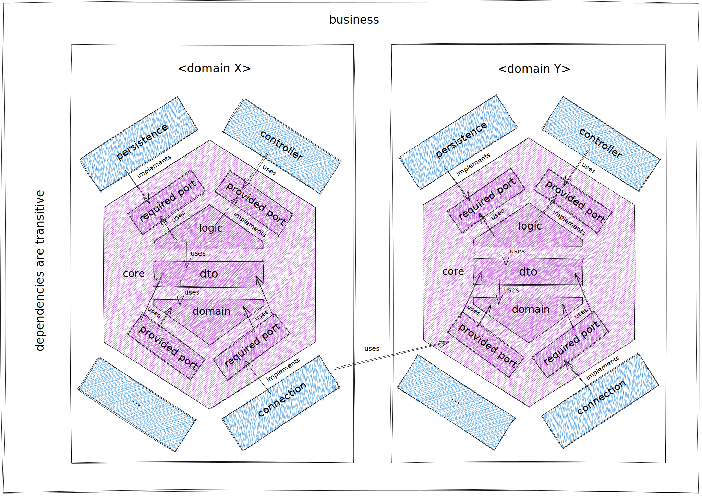

# hexagonal

An example implementation of the [My Thai Star](https://devonfw.com/website/pages/docs/master-my-thai-star.asciidoc_technical-design.html)
application in the hexagonal architecture.

# Modul architecture
Modules are grouped on multiple levels to facilitate working with a lot of code. 
The highest level consists of four groups: business, connector, orchestration,
and util. They are called subsystems.

## Subsystem _business_
A business includes modules with business knowledge. 
They are divided into domains, which consist of two parts: the core and adapters.

### Core modules
A core implements pure business logic, independent of specific frameworks.
It is divided into three parts: domain, logic, and boundary.

#### Module _domain_
A domain contains entities and data types such as enumerations. 
They can be used by all other modules if the modules don't need more specialized transport objects.

#### Module _logic_
Logic is a module that implements use cases.

#### Module _boundary_
Boundary contains only interfaces and optionally transport objects necessary for communication between modules,
for example logic and adapters. 
Boundary belongs to the cora to make it easier to follow the rule that core modules do not depend on any other modules 
(except util). Boundary includes two kinds of interfaces: provided and required.

Provided interfaces are implemented by logic that provides access to logic for modules outside the core.

Required interfaces are implemented by adapter modules and are used by core modules.

### Adapter modules
A adapter modules implement technical aspects, and they are used to linking core modules to specific frameworks.

## Subsystem _connector_
A connector subsystem has a similar structure as the business subsystem, 
with the difference that instead of business knowledge and division into domains, 
we have knowledge about external systems here. The rest remains the same.

## Subsystem _util_
A util subsystem includes modules not related to business knowledge. 
They can be imported from any other module, but of course no cycles are allowed.

## Subsystem _orchestration_
An orchestration subsystem contains the objects necessary to create executable applications. 
It consists of two subsets, configurations and classes with main method.